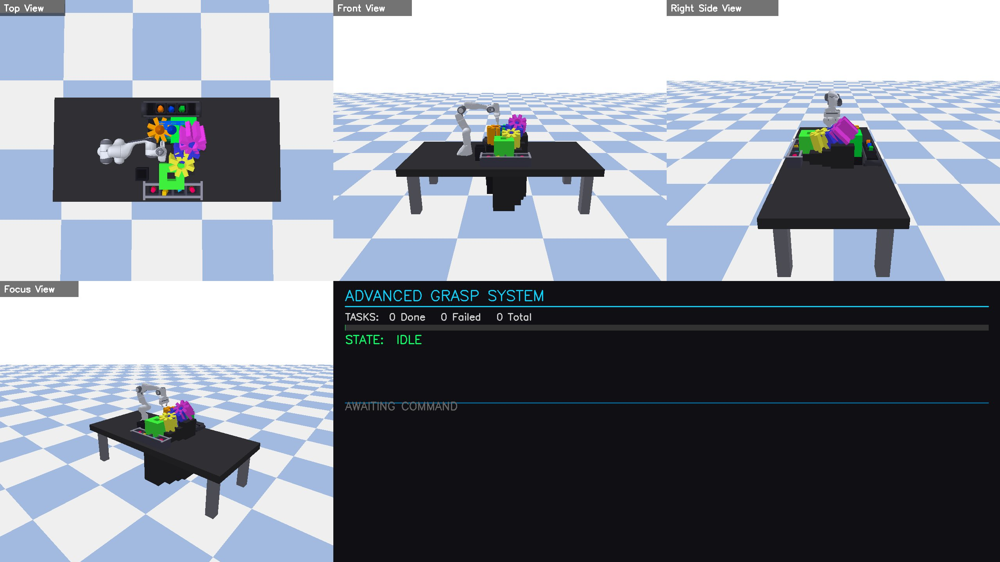
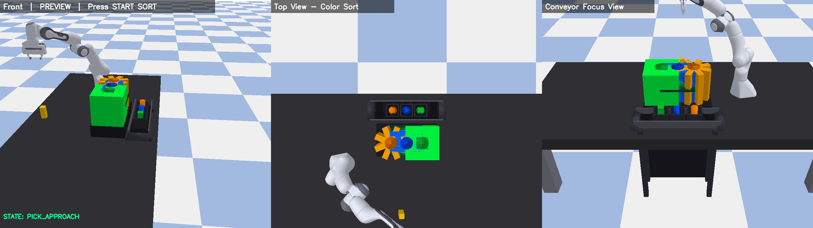
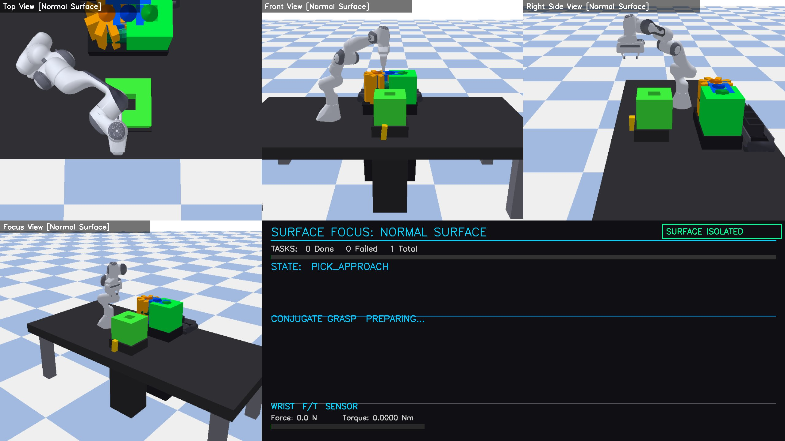
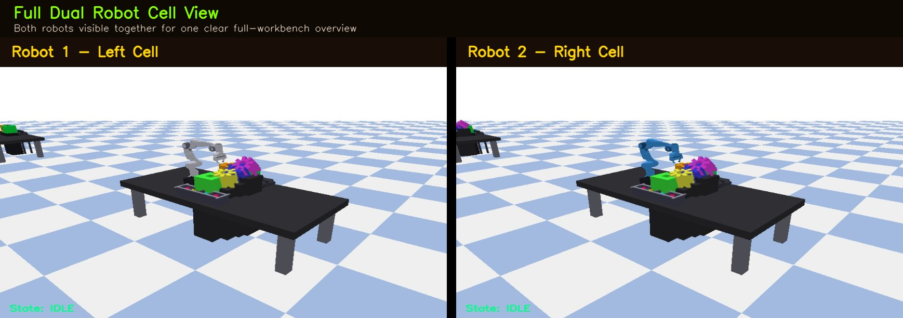
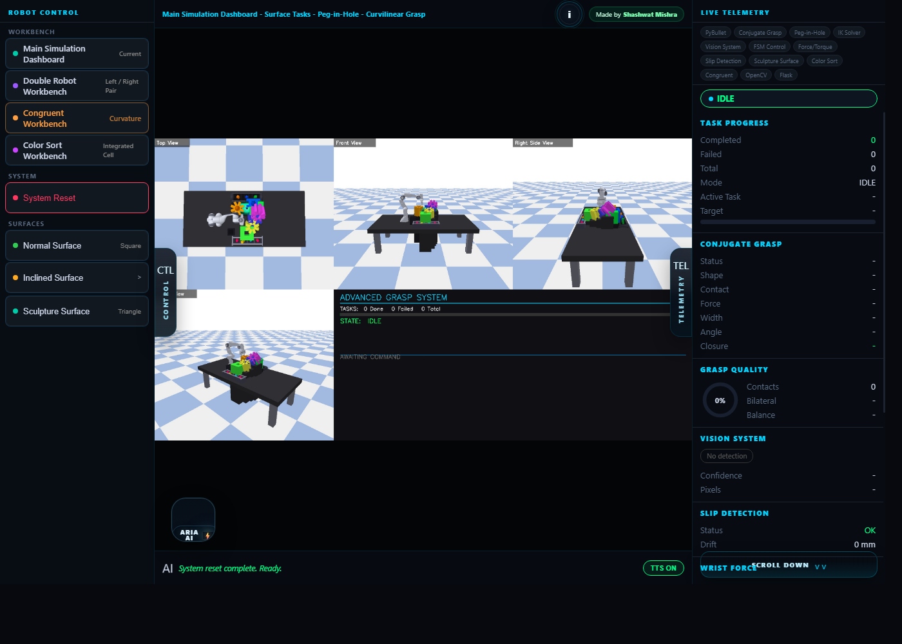
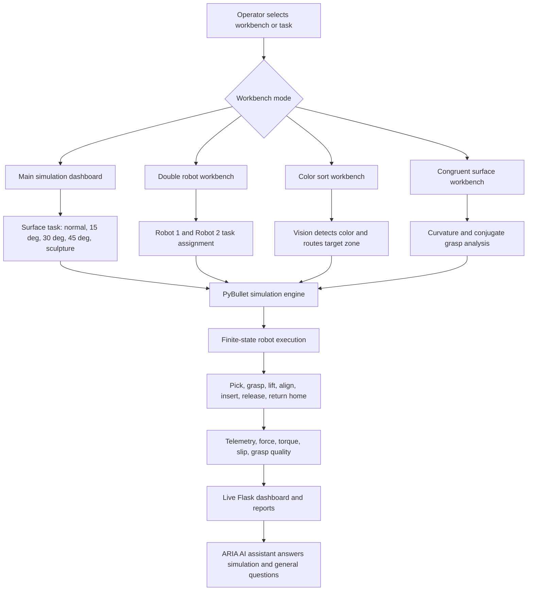
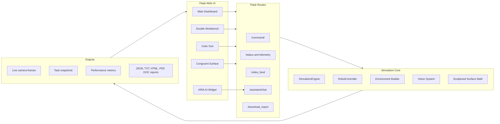

<div align="center">

# Robot ARM Peg-in-Hole Simulation

### Normal, Inclined, Sculpture, Color Sort, Double Workbench, Conjugate Grasp, and ARIA AI


An advanced robotic manipulation dashboard for peg-in-hole insertion, inclined surface handling, sculptured surface insertion, color sorting, dual robot operation, live telemetry, performance reports, and AI-assisted simulation understanding.

</div>

---

## Project Demo

<div align="center">
  <a href="https://www.youtube.com/watch?v=QZeioaCVRpE" target="_blank">
    
  </a>
  <br>
  <b>Click the preview to watch the full project demonstration.</b>
</div>

---

## Live Performance Gallery

The repository includes captured simulation views for every major task and workbench.

| Main Simulation | Normal Surface |
|---|---|
|  |  |

| Inclined 15 deg | Inclined 30 deg |
|---|---|
|  |  |

| Inclined 45 deg | Sculpture Surface |
|---|---|
|  |  |

| Color Sort | Conjugate Grasp |
|---|---|
|  |  |

| Double Workbench | ARIA AI |
|---|---|
|  |  |

---

## What This Project Does

This project simulates a Franka Panda-style robotic arm performing industrial manipulation tasks inside a modern Flask dashboard. The robot performs surface-aware peg-in-hole insertion, monitors grasp quality, detects slip, tracks force and torque, runs vision-based color sorting, and exposes the complete run through live dashboards and downloadable reports.

Core workbenches:

- **Main Simulation Dashboard**: primary control surface for normal, inclined, and sculptured peg-in-hole tasks.
- **Double Robot Workbench**: two independent robot cells running task assignments in parallel.
- **Normal Surface**: square peg insertion on a flat target plane.
- **Inclined Surfaces**: cylinder peg insertion on 15 deg, 30 deg, and 45 deg inclined surfaces.
- **Sculpture Surface**: triangle peg insertion on a curved sculptured surface.
- **Color Sort Workbench**: OpenCV-assisted orange, blue, and green object sorting.
- **Conjugate Grasp Workbench**: curvature-aware grasp and insertion analysis.
- **ARIA AI Assistant**: dashboard assistant for simulation status, workflow help, telemetry explanation, and general questions.

---

## Key Features

- Real-time PyBullet robotic simulation with embedded camera feeds.
- Peg-in-hole insertion across flat, inclined, and curved surfaces.
- Conjugate grasp control with force, width, angle, closure, and surface metadata.
- Live grasp quality scoring with contact, bilateral balance, and slip feedback.
- OpenCV-based color recognition and sorting pipeline.
- Dual robot dashboard with independent left and right task cells.
- Live telemetry for end-effector pose, joints, force, torque, task progress, and surface state.
- Snapshot and report generation in JSON, TXT, HTML, PDF, and DOC-style formats.
- ARIA AI assistant powered by Groq with local simulation-aware routing.
- Modern responsive dashboard UI for presentation and demonstration.

---

## System Flow Chart



---

## Block Diagram



---

## Workbench Details

### 1. Main Simulation Dashboard

The main dashboard is the central operator console. It contains task controls, live camera feed, telemetry cards, conjugate grasp information, force plots, slip detection, vision output, and the ARIA AI assistant.

### 2. Normal Surface

The normal surface task demonstrates baseline peg-in-hole insertion using a square peg and flat target surface. It is useful for validating robot motion, grasp stability, and insertion accuracy before moving to harder surfaces.

### 3. Inclined Surfaces

The inclined tasks test peg insertion under geometric difficulty:

- **15 deg incline**: low-angle insertion with mild alignment compensation.
- **30 deg incline**: medium-angle insertion with stronger orientation correction.
- **45 deg incline**: high-angle insertion with more demanding stability and force control.

### 4. Sculpture Surface

The sculpture surface task uses a curved target profile and triangle peg handling. It demonstrates curved-surface interaction, surface metadata, adaptive insertion planning, and return-to-slot behavior.

### 5. Color Sort

The color sort workbench combines robot manipulation with a vision pipeline. The system detects object color, chooses the correct zone, performs grasping, lifts and scans the object, aligns with the target, inserts it, releases it, and returns home.

### 6. Double Workbench

The double workbench runs two robot cells side by side. Each cell has its own status, task assignment, camera feed, telemetry, grasp data, and progress summary. This is useful for showing scalable multi-cell robotic operation.

### 7. Conjugate Grasp

The conjugate grasp module adapts grasp behavior using shape, surface angle, curvature, contact quality, force, and closure metrics. It helps explain why the robot can handle different peg shapes and surface geometries.

### 8. ARIA AI

ARIA AI is embedded inside the dashboard. It can answer general questions, explain simulation telemetry, summarize robot state, interpret force or grasp quality, and help the user understand the active workbench.

---

## Technology Stack

| Layer | Tools |
|---|---|
| Backend | Python, Flask |
| Simulation | PyBullet, NumPy |
| Robot Control | IK, FSM control, grasp constraints |
| Vision | OpenCV |
| AI Assistant | Groq API, local simulation context |
| Frontend | HTML, CSS, JavaScript |
| Reporting | JSON, TXT, HTML, PDF, DOC-style exports |

---

## Installation

```bash
git clone https://github.com/SHASHWAT-MISHRA-997/Robot-ARM-Peg-in-Hole-Normal-Inclined-Sculpture-Color-Sort-Simulation.git
cd Robot-ARM-Peg-in-Hole-Normal-Inclined-Sculpture-Color-Sort-Simulation
python -m venv venv
venv\Scripts\activate
pip install -r requirements.txt
```

Optional AI assistant configuration:

```bash
copy .env.example .env
```

Add your Groq API key inside `.env` if you want ARIA AI remote responses.

---

## Run

```bash
python app.py
```

Open the dashboard:

```text
http://127.0.0.1:5000
```

Available pages:

- Main dashboard: `http://127.0.0.1:5000/`
- Double robot workbench: `http://127.0.0.1:5000/double`
- Color sort workbench: `http://127.0.0.1:5000/color_sort`
- Congruent surface workbench: `http://127.0.0.1:5000/congruent_surface`

---

## Project Structure

```text
.
|-- app.py                    # Flask routes, dashboards, assistant endpoints, reports
|-- simulation_engine.py      # PyBullet simulation engine and task state machine
|-- robot_control.py          # Robot motion, grasping, IK, constraints, telemetry
|-- environment.py            # Surface, table, robot world, and scene construction
|-- vision.py                 # Vision and color detection helpers
|-- sculptured_surface.py     # Curved surface and conjugate geometry math
|-- groq_chat_helper.py       # Groq helper used by ARIA AI
|-- templates/                # Dashboard HTML views
|-- static/                   # ARIA widget and UI assets
|-- assets/screenshots/       # README performance screenshots
|-- docs/                     # Flow chart and block diagram sources
|-- requirements.txt
`-- README.md
```

---

## Performance and Reporting

The dashboard tracks:

- completed, failed, and total tasks
- active mode and target surface
- grasp quality score
- bilateral contact state
- slip and drift
- force and torque history
- end-effector pose
- joint positions
- vision detection confidence
- surface curvature data for sculptured/congruent tasks

Reports can be downloaded from the app after task execution in multiple formats.

---

## Author

**Shashwat Mishra**

- LinkedIn: [Shashwat Mishra](https://www.linkedin.com/in/sm980/)
- GitHub: [SHASHWAT-MISHRA-997](https://github.com/SHASHWAT-MISHRA-997)

---

<div align="center">

### Built for robotic simulation, visual presentation, and intelligent dashboard interaction.

</div>
